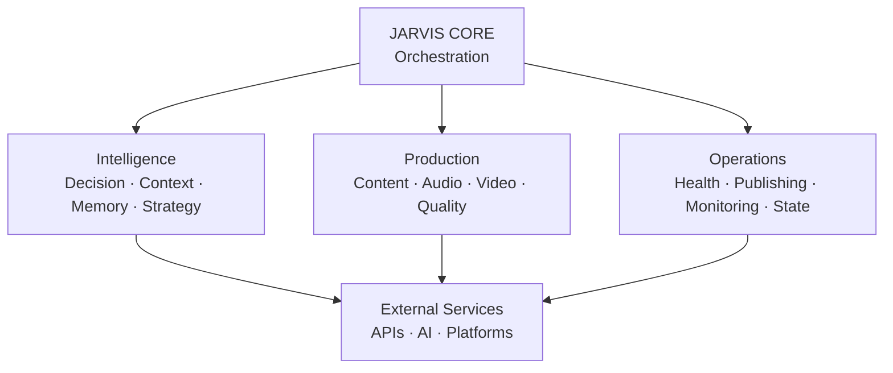
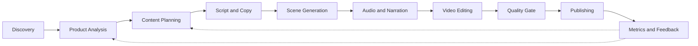

# 🤖 JARVIS AI

### Modular AI-powered automation and content production system

> A software system designed to orchestrate intelligent decision-making, content workflows, multimedia production, quality control, state management and automated distribution.

---

## 🧠 Overview

**JARVIS** is a modular software system built around Artificial Intelligence, automation and specialized components.

The project started as an attempt to automate digital content workflows and gradually evolved into a broader engineering laboratory for exploring:

- Artificial Intelligence and LLM integrations
- Agent-based software architecture
- Workflow orchestration
- Automated decision-making
- Context and state management
- Product intelligence
- Content planning and generation
- Audio and video processing
- Automated quality control
- Platform integrations
- Data-driven optimization
- System supervision and health checks
- Process automation

The central idea is:

> **Transform complex multi-step workflows into an orchestrated software system capable of making decisions, executing specialized tasks, validating results and recovering from failures.**

JARVIS is an actively evolving personal engineering project. Its architecture changes as new components, workflows and experiments are developed.

---

## 🎯 Project Goals

JARVIS is designed around a few fundamental goals:

### 1. Orchestration

Coordinate multiple specialized components through a central execution flow.

### 2. Intelligence

Use AI-powered components to analyze context, products, content and possible actions.

### 3. Automation

Reduce repetitive manual work by connecting independent stages into automated pipelines.

### 4. Production

Transform structured information into finished multimedia content.

### 5. Quality

Validate generated outputs before they move to later stages of the pipeline.

### 6. State

Maintain information about execution state, production workflows and system operations.

### 7. Optimization

Use metrics, scoring and feedback to improve future decisions and workflows.

---

# 🏗️ System Architecture

At a high level, JARVIS is organized around a central orchestration layer.



The architecture separates responsibilities into specialized domains instead of concentrating the entire workflow inside a single monolithic component.

---

# 🤖 Agent & Component Architecture

JARVIS contains multiple specialized agents and services.

The repository currently includes components dedicated to intelligence, products, assets, content, audio, video, supervision, publishing, providers and system state.

---

## 🧠 Intelligence & Decision Layer

Responsible for context, decisions, strategy, memory and evaluation.

Representative components:

- `decision_engine.py`
- `context_engine.py`
- `memory_agent.py`
- `strategy.py`
- `scoring.py`
- `commander.py`

This layer provides the reasoning and decision-oriented foundation used by other parts of the system.

---

## 📦 Product Intelligence

Responsible for discovering, classifying, cleaning and analyzing products.

Representative components:

- `product_agent.py`
- `product_hunter.py`
- `product_classifier.py`
- `product_cleaner.py`
- `shopee_affiliate.py`

Typical responsibilities include:

- Product discovery
- Product classification
- Data normalization
- Product scoring
- Catalog organization
- Affiliate workflow integration

---

## 📡 Discovery & Radar

JARVIS contains components designed to monitor information sources and identify content opportunities.

Examples include:

- `telegram_radar.py`
- `telegram_repurpose_hunter.py`
- `product_hunter.py`

These components can feed information into later decision and production stages.

---

# ✍️ Content Intelligence

The content layer transforms structured information into content plans and creative instructions.

Representative components:

- `content_planner.py`
- `hook_builder.py`
- `descricao_builder.py`
- `copy_adapter.py`
- `narration_script_builder.py`
- `scene_prompt_builder.py`

Responsibilities include:

- Content planning
- Hooks
- Copy generation
- Descriptions
- Calls to action
- Narration scripts
- Scene planning
- Creative prompts

---

# 🎨 Asset Intelligence

The asset layer handles the discovery, collection, routing and generation of visual resources.

Representative components:

- `asset_agent.py`
- `asset_collector_agent.py`
- `asset_hunter_agent.py`
- `asset_autopilot_agent.py`
- `asset_router.py`
- `creative_asset_generator_agent.py`
- `image_provider.py`

The goal is to make assets available to downstream production stages without requiring every workflow to manually handle them.

---

# 🎧 Audio & Narration

JARVIS contains dedicated components for audio selection, narration and voice generation.

Representative components:

- `audio_collector_agent.py`
- `audio_selector_agent.py`
- `audio_autopilot_agent.py`
- `narrated_video_agent.py`
- `tts_edge.py`

The audio pipeline can handle tasks such as:

- Audio discovery
- Audio selection
- Text-to-speech
- Narration generation
- Audio integration into production workflows

---

# 🎬 Video Production

The video production layer is responsible for transforming scripts, assets and audio into finished multimedia outputs.

Representative components:

- `editing_brain.py`
- `product_video_editor.py`
- `product_video_renderer.py`
- `local_video_renderer.py`
- `ia_scene_generator.py`
- `produzir_video.py`

The production workflow can involve:

- Scene planning
- Asset selection
- Narration
- Audio integration
- Editing decisions
- Video composition
- Rendering
- Subtitle/caption processing
- Output validation

---

# 🛡️ Quality Control & Supervision

Quality is treated as a dedicated stage rather than an afterthought.

Representative components:

- `auditor.py`
- `quality_gate.py`
- `supervisor.py`
- `supervisor_agent.py`
- `health_check.py`
- `health_check_agent.py`

These components support:

- Output validation
- Quality gates
- Health checks
- Workflow supervision
- Error detection
- Execution monitoring

The goal is to prevent invalid or low-quality outputs from automatically progressing through the pipeline.

---

# 📊 Performance, Scoring & Feedback

JARVIS includes components designed to support evaluation and continuous optimization.

Examples:

- `performance_agent.py`
- `scoring.py`
- State management components
- Production state
- Analytics-related workflows

This layer allows the system to use execution information and performance data as inputs for future decisions.

---

# 🔄 End-to-End Production Pipeline

A simplified representation of the workflow:



The pipeline is intentionally modular.

A stage can be replaced, improved or expanded without requiring the entire system to be rewritten.

---

# ⚙️ Core Capabilities

## 📡 Discovery

Components for identifying products, content opportunities and external information.

Includes:

- Product discovery
- Product hunting
- Telegram radar workflows
- Content opportunity discovery
- Product classification
- Product scoring

---

## 🧠 AI-Powered Content

JARVIS can integrate AI components into multiple stages of the workflow.

Examples include:

- Text generation
- Copywriting
- Content planning
- Hooks
- Descriptions
- Calls to action
- Narration scripts
- Scene prompts
- Creative asset generation

---

## 🎬 Multimedia Production

The system contains dedicated components for automated multimedia workflows.

Examples:

- Audio processing
- Text-to-speech
- Narration
- Scene generation
- Video editing
- Video rendering
- Subtitle/caption processing
- Quality validation

---

## 🔌 External Integrations

JARVIS is designed around provider-based integrations.

The repository contains components for external services and platforms including:

- OpenAI
- Telegram
- Meta
- TikTok
- YouTube
- Shopee
- Amazon
- Mercado Livre
- AI voice providers
- AI video providers

Provider availability depends on credentials, API access, platform policies and the current implementation.

---

# 🧩 Provider Architecture

External services are isolated through provider-oriented components.

Examples currently present in the repository include:

- `base_provider.py`
- `fal_provider.py`
- `grok_provider.py`
- `heygen_provider.py`
- `pixverse_provider.py`
- `manual_provider.py`

This approach makes it possible to introduce or replace external providers without tightly coupling the entire system to a single service.

---

# 📤 Publishing & Distribution

JARVIS contains components for automated distribution workflows.

Examples include:

- `meta_uploader.py`
- `telegram_poster.py`
- `telegram_radar.py`
- `publish_guard.py`
- `publish_pack_builder.py`

Platform-specific automation is intentionally isolated from the core production pipeline.

External platform behavior depends on:

- API availability
- Authentication
- Account permissions
- Platform policies
- Rate limits
- Current implementation

---

# 🧠 State Management

State is an important part of the architecture.

Representative components include:

- `production_state.py`
- `state_manager.py`
- `state.json`
- `supervisor_state.json`

State management allows workflows to preserve information between execution stages and helps the system coordinate long-running or multi-step processes.

---

# 🎛️ Orchestration

The orchestration layer coordinates execution across the different components.

Representative components include:

- `orchestrator.py`
- `autonomous_orchestrator.py`
- `daemon_maestro.py`
- `executor_main.py`
- `engine.py`
- `main.py`

The architecture is designed so that orchestration is separated from individual capabilities.

This allows specialized components to focus on their own responsibilities while the orchestration layer coordinates the overall workflow.

---

# 🏥 Monitoring & Recovery

Reliability is an important part of the project.

JARVIS includes components for:

- Health checks
- Supervision
- State tracking
- Quality gates
- Error handling
- Workflow validation
- Execution monitoring

Representative modules:

```text
health_check.py
health_check_agent.py
supervisor.py
supervisor_agent.py
quality_gate.py
auditor.py
state_manager.py
```

The long-term goal is to make workflows increasingly capable of detecting failures and recovering without unnecessary manual intervention.

---

# 🛠️ Technology Stack

| Area | Technologies |
|---|---|
| Primary Language | Python |
| Artificial Intelligence | LLMs, Generative AI, AI APIs |
| APIs | REST APIs, External Service APIs |
| Automation | Playwright, Custom Automation |
| Multimedia | FFmpeg, Video/Audio Processing |
| Voice | Text-to-Speech Providers |
| Data | SQLite, State Files, Structured Data |
| Infrastructure | Linux, Docker |
| Messaging | Telegram |
| Version Control | Git, GitHub |
| Web Automation | Playwright |
| External Providers | AI, Media and Platform APIs |

The technology stack evolves together with the architecture.

---

# 📁 Project Structure

The repository is organized around functional domains.

A simplified view:

```text
projeto-jarvis-completo/
│
├── Intelligence
│   ├── decision_engine.py
│   ├── context_engine.py
│   ├── memory_agent.py
│   ├── strategy.py
│   └── scoring.py
│
├── Products
│   ├── product_agent.py
│   ├── product_hunter.py
│   ├── product_classifier.py
│   └── product_cleaner.py
│
├── Assets
│   ├── asset_agent.py
│   ├── asset_collector_agent.py
│   ├── asset_hunter_agent.py
│   ├── asset_router.py
│   └── creative_asset_generator_agent.py
│
├── Content
│   ├── content_planner.py
│   ├── hook_builder.py
│   ├── copy_adapter.py
│   ├── descricao_builder.py
│   ├── narration_script_builder.py
│   └── scene_prompt_builder.py
│
├── Audio
│   ├── audio_collector_agent.py
│   ├── audio_selector_agent.py
│   ├── audio_autopilot_agent.py
│   ├── narrated_video_agent.py
│   └── tts_edge.py
│
├── Video
│   ├── editing_brain.py
│   ├── product_video_editor.py
│   ├── product_video_renderer.py
│   ├── local_video_renderer.py
│   └── ia_scene_generator.py
│
├── Quality
│   ├── auditor.py
│   ├── quality_gate.py
│   ├── supervisor.py
│   └── health_check.py
│
├── Orchestration
│   ├── orchestrator.py
│   ├── autonomous_orchestrator.py
│   ├── daemon_maestro.py
│   └── executor_main.py
│
├── Providers
│   ├── base_provider.py
│   ├── fal_provider.py
│   ├── grok_provider.py
│   ├── heygen_provider.py
│   └── pixverse_provider.py
│
├── Publishing
│   ├── meta_uploader.py
│   ├── telegram_poster.py
│   ├── publish_guard.py
│   └── publish_pack_builder.py
│
├── State
│   ├── production_state.py
│   └── state_manager.py
│
├── Configuration
│   └── providers_config.json
│
├── main.py
├── requirements.txt
└── README.md
```

This is a conceptual representation of the architecture, not a complete listing of every file in the repository.

---

# 🧪 Engineering Concepts

JARVIS is primarily an engineering laboratory.

The project provides practical experience with:

- Modular architecture
- Separation of responsibilities
- Agent-based design
- Workflow orchestration
- API integration
- Provider abstraction
- State management
- Error handling
- Quality gates
- Process automation
- Multimedia processing
- AI integration
- Data-driven decision making
- System supervision
- External service integration

The architecture is continuously refactored as new capabilities are developed.

---

# 🚀 Getting Started

> **Development status:** JARVIS is an actively evolving personal project. Dependencies, configuration and execution flows may change.

## 1. Clone the repository

```bash
git clone https://github.com/z-scriptz/projeto-jarvis-completo.git
cd projeto-jarvis-completo
```

## 2. Create a virtual environment

### Windows

```bash
python -m venv .venv
.venv\Scripts\activate
```

### Linux / macOS

```bash
python3 -m venv .venv
source .venv/bin/activate
```

## 3. Install dependencies

```bash
pip install -r requirements.txt
```

## 4. Configure external services

Configure the credentials and environment variables required by the providers and workflows you intend to use.

Do not commit real credentials.

## 5. Run the appropriate entry point

Because JARVIS contains multiple workflows and execution paths, the correct entry point depends on the component or pipeline being tested.

The repository contains several execution-oriented modules, including:

```text
main.py
engine.py
executor_main.py
orchestrator.py
autonomous_orchestrator.py
```

Refer to the source code and configuration associated with the workflow you want to execute.

---

# 🔐 Security

Never commit sensitive credentials to the repository.

This includes:

- API keys
- Access tokens
- Passwords
- Session cookies
- Private credentials
- Bot tokens
- Production secrets

Use environment variables or local configuration.

Example:

```env
OPENAI_API_KEY=your_key_here
TELEGRAM_BOT_TOKEN=your_token_here
```

> **Never commit real credentials to Git.**

---

# ⚠️ External Services

JARVIS integrates with external services whose behavior is outside the control of this project.

External integrations may be affected by:

- API changes
- Authentication requirements
- Rate limits
- Service availability
- Account permissions
- Terms of Service
- Platform policies

Users are responsible for using external services in accordance with their respective policies.

---

# 🧭 Design Principles

The project follows several principles.

### Modularity

Components should have clear responsibilities and remain replaceable whenever practical.

### Separation of Concerns

Decision-making, production, publishing, monitoring and state should not be unnecessarily coupled.

### Provider Abstraction

External services should be isolated behind provider-oriented interfaces whenever possible.

### Validation Before Distribution

Generated outputs should pass appropriate validation before reaching publishing stages.

### State Awareness

Long-running workflows need explicit state rather than relying exclusively on in-memory execution.

### Continuous Improvement

The architecture is expected to change as new requirements, failures and experiments reveal better solutions.

---

# 🗺️ Roadmap

JARVIS is continuously evolving.

Possible future directions include:

- [ ] More advanced multi-agent orchestration
- [ ] Centralized memory architecture
- [ ] More sophisticated decision systems
- [ ] Advanced analytics
- [ ] Expanded observability
- [ ] Real-time monitoring
- [ ] More robust automated testing
- [ ] Improved deployment infrastructure
- [ ] Public-facing API
- [ ] Web-based management interface
- [ ] Greater workflow autonomy
- [ ] Improved recovery and fault tolerance

The roadmap is intentionally flexible because JARVIS is an active research and engineering project rather than a finished commercial product.

---

# 📌 Project Status

### 🟢 Active Development

JARVIS is a personal software engineering project under continuous development.

The public repository represents a development snapshot of the system. The architecture may evolve significantly as new components, experiments and workflows are introduced.

Some modules may be:

- Experimental
- Environment-specific
- Incomplete
- Under refactoring
- Dependent on external services

This is intentional.

JARVIS is being developed as a practical laboratory for building increasingly complex software systems.

---

# 🧠 What JARVIS Represents

JARVIS is more than an automation script.

The project is an exploration of how multiple software components can work together to form a coordinated intelligent workflow.

The long-term architectural direction is:

```text
Information
     ↓
Context
     ↓
Decision
     ↓
Planning
     ↓
Execution
     ↓
Validation
     ↓
Distribution
     ↓
Feedback
     ↓
Improved Decision
```

The objective is to continuously reduce the amount of manual coordination required between these stages while maintaining control, observability and quality.

---

# 🎓 Why I Built JARVIS

JARVIS is also my main practical software engineering laboratory.

Through the project, I have been able to study and apply concepts involving:

- Backend development
- Python
- APIs
- Databases
- AI integrations
- Automation
- System architecture
- Multimedia processing
- State management
- Error handling
- Software modularity
- Infrastructure
- External service integration

Instead of learning these concepts only through isolated exercises, I use JARVIS to connect them inside a real evolving system.

> **Building systems is how I learn. JARVIS is where I put that into practice.**

---

# ⚖️ Responsible Use

JARVIS is intended for educational, experimental and software engineering purposes.

Automated interaction with external platforms must comply with:

- The platform's Terms of Service
- API policies
- Authentication requirements
- Rate limits
- Applicable laws and regulations

The project does not guarantee compatibility with third-party platforms as their APIs and policies may change.

---

# 👨‍💻 Author

**André Felipe de Aquino Oliveira**

Software Engineering Student · Developer · AI & Automation

📍 Goiânia, Brazil

### Links

- GitHub: https://github.com/z-scriptz
- LinkedIn: https://www.linkedin.com/in/andré-felipe

---

## ⭐ Project

If you find the architecture or implementation interesting, feel free to explore the repository and follow its development.

JARVIS is an ongoing project, and its architecture will continue to evolve as new engineering problems are solved.
