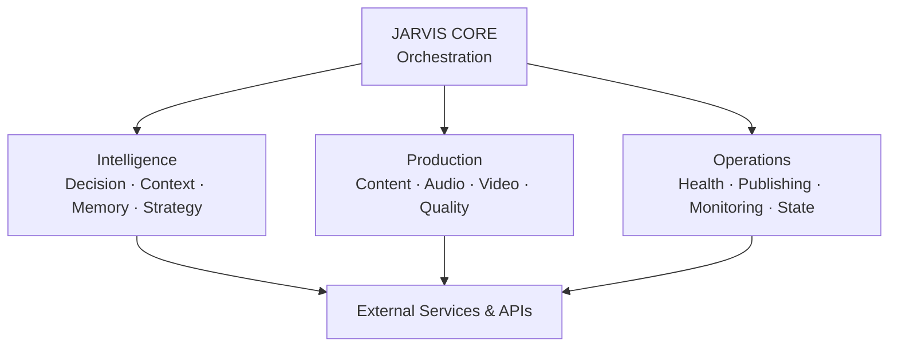
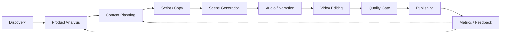

# 🤖 JARVIS AI

### Autonomous AI-Powered Content Production & Automation System

> A modular AI-driven system designed to orchestrate content discovery, planning, generation, multimedia production, quality control, analytics and automated distribution.

---

## 🧠 Overview

**JARVIS** is a modular software system built around Artificial Intelligence, automation and specialized components.

The project was originally created to automate digital content workflows, but evolved into a broader engineering laboratory for exploring:

- AI orchestration
- Agent-based architectures
- Automated decision making
- Content pipelines
- Multimedia processing
- API integrations
- Data analysis
- State management
- Quality control
- Automated publishing
- System monitoring

The core idea is simple:

> **Turn a complex multi-step workflow into an orchestrated software pipeline capable of making decisions, executing tasks and recovering from failures.**

---

## 🏗️ System Architecture

JARVIS is organized around a central orchestration layer that coordinates specialized components for intelligence, production and operations.

---

🤖 Agent-Based Architecture

One of the main characteristics of JARVIS is the separation of responsibilities into specialized components.

🧠 Intelligence

Core decision and reasoning components:

decision_engine.py

context_engine.py

memory_agent.py

strategy.py

scoring.py

Responsible for context, decisions, strategy, memory and evaluation.

---

📦 Product Intelligence

Product discovery and analysis:

product_agent.py

product_hunter.py

product_classifier.py

product_cleaner.py

Responsible for product discovery, organization, classification and analysis.

---

🎬 Content & Creative Production

Content planning and creative generation:

content_planner.py

hook_builder.py

scene_prompt_builder.py

creative_asset_generator_agent.py

narration_script_builder.py

Responsible for transforming ideas and products into structured content.

---

🎧 Audio & Narration

Audio and voice processing:

audio_collector_agent.py

audio_selector_agent.py

audio_autopilot_agent.py

narrated_video_agent.py

tts_edge.py

Responsible for audio selection, narration and voice generation.

---

🎞️ Video Processing

Video composition and rendering:

editing_brain.py

product_video_editor.py

product_video_renderer.py

local_video_renderer.py

ia_scene_generator.py

Responsible for video composition, rendering and multimedia processing.

---

🛡️ Quality & Supervision

Validation and system health:

auditor.py

quality_gate.py

supervisor.py

supervisor_agent.py

health_check.py

health_check_agent.py

Responsible for validation, quality control, supervision and system health.

---

📊 Performance & Analytics

Performance-oriented components include:

performance_agent.py

scoring.py

state management components

analytics workflows

Designed to support data-driven decisions and continuous optimization.

---

🔄 End-to-End Production Pipeline

A simplified representation of the production workflow:

---

⚙️ Core Capabilities

📡 Discovery & Radar

The system contains components for discovering products, trends and content opportunities.

Capabilities include:

Product discovery

Trend monitoring

Product classification

Product scoring

Catalog organization

Telegram-based radar workflows

---

🧠 AI & Content Generation

JARVIS integrates AI-powered components for:

Text generation

Copywriting

Titles

Descriptions

Calls to action

Scene prompts

Content planning

Creative asset generation

---

🎬 Automated Video Production

The production pipeline contains components for:

Script generation

Scene planning

Audio selection

Text-to-speech

Video generation

Editing

Rendering

Subtitle generation

Quality validation

---

📱 Distribution & Publishing

The project contains workflows and integrations targeting multiple digital platforms.

Current repository components include integrations for services such as:

TikTok

Instagram / Meta

YouTube

Telegram

Affiliate platforms

Platform behavior depends on the APIs, credentials and policies of each service.

---

🔌 Integrations & Providers

The repository contains provider modules for external AI, media and platform services.

Examples represented in the codebase include:

OpenAI

Telegram

Meta

TikTok

YouTube

Shopee

Amazon

Mercado Livre

AI voice services

AI video services

Provider availability depends on credentials, API access and the current implementation.

---

🛠️ Technology Stack

Area	Technologies

Language	Python
AI	Generative AI / LLMs
APIs	REST APIs
Video	FFmpeg / OpenCV
Data	SQLite / PostgreSQL
Automation	Playwright
Infrastructure	Docker
Messaging	Telegram
Version Control	Git / GitHub
Voice	TTS providers
Media	Audio / Video processing

---

📁 Project Structure

The repository follows a modular architecture.

projeto-jarvis-completo/
│
├── Agents & Intelligence
│   ├── decision_engine.py
│   ├── context_engine.py
│   ├── memory_agent.py
│   ├── supervisor_agent.py
│   └── performance_agent.py
│
├── Content & Production
│   ├── content_planner.py
│   ├── editing_brain.py
│   ├── narration_script_builder.py
│   ├── product_video_editor.py
│   └── product_video_renderer.py
│
├── Assets & Media
│   ├── asset_agent.py
│   ├── asset_collector_agent.py
│   ├── asset_hunter_agent.py
│   └── creative_asset_generator_agent.py
│
├── Products
│   ├── product_agent.py
│   ├── product_hunter.py
│   ├── product_classifier.py
│   └── product_cleaner.py
│
├── Providers
│   ├── base_provider.py
│   ├── fal_provider.py
│   ├── grok_provider.py
│   ├── heygen_provider.py
│   └── pixverse_provider.py
│
├── Publishing
│   ├── meta_uploader.py
│   ├── telegram_poster.py
│   ├── telegram_radar.py
│   └── publish_guard.py
│
├── Quality & Monitoring
│   ├── auditor.py
│   ├── quality_gate.py
│   ├── health_check.py
│   └── health_check_agent.py
│
├── Orchestration
│   ├── orchestrator.py
│   ├── autonomous_orchestrator.py
│   ├── daemon_maestro.py
│   └── executor_main.py
│
└── Configuration & State
    ├── providers_config.json
    ├── production_state.py
    ├── state_manager.py
    └── requirements.txt

---

🧩 Engineering Highlights

This project serves as a practical engineering laboratory for applying concepts such as:

Modular architecture

Separation of responsibilities

Agent-based system design

Workflow orchestration

API integration

State management

Error handling

Quality gates

Automated pipelines

Multimedia processing

AI integration

Data-driven decision making

System monitoring

Process automation

The architecture is continuously evolving as new ideas, technologies and workflows are tested.

---

🚀 Installation

> Development status: JARVIS is an actively evolving personal project. Configuration and dependencies may change as the architecture evolves.

Clone

git clone https://github.com/z-scriptz/projeto-jarvis-completo.git
cd projeto-jarvis-completo

Create a virtual environment

python -m venv .venv

Windows

.venv\Scripts\activate

Linux / macOS

source .venv/bin/activate

Install dependencies

pip install -r requirements.txt

Configure the required environment variables and API credentials according to the providers being used.

---

🔐 Security

Never commit:

API keys

Passwords

Access tokens

Session cookies

Private credentials

Production secrets

Use environment variables or a local .env configuration.

Example:

OPENAI_API_KEY=your_key_here
TELEGRAM_BOT_TOKEN=your_token_here

> Never commit real credentials to Git.

---

🗺️ Roadmap

JARVIS is under continuous development.

Potential future directions include:

[ ] Web dashboard

[ ] Centralized memory system

[ ] Expanded multi-agent orchestration

[ ] Advanced analytics

[ ] Real-time monitoring

[ ] Improved autonomous decision making

[ ] Public API

[ ] Improved observability

[ ] Automated testing

[ ] More robust deployment infrastructure

---

⚠️ Project Status

Active Development

JARVIS is primarily a personal engineering and experimentation project.

Some components may be experimental, incomplete or tightly coupled to specific environments and external services.

The architecture is continuously refactored as new capabilities are developed and tested.

---

⚖️ Responsible Use

This project is intended for educational, experimental and software engineering purposes.

External platform integrations must be used according to the respective platform's Terms of Service, API policies and applicable laws.

---

👨‍💻 Author

André Felipe de Aquino Oliveira

Software Engineering Student · Developer · AI & Automation

📍 Goiânia, Brazil

GitHub: https://github.com/z-scriptz

LinkedIn: https://www.linkedin.com/in/andré-felipe

---

⭐ If you find the project interesting, feel free to explore the code and follow its development.

---
